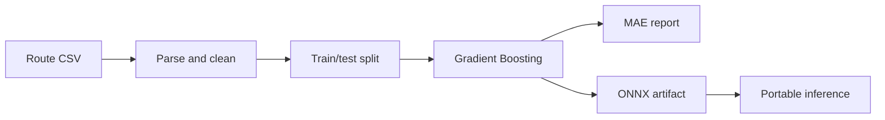

<div align="center">

<h1>🚄 RailTimeML</h1>

<p><strong>A reproducible machine-learning baseline for Vande Bharat journey-time prediction.</strong></p>

   

<p>
  <a href="#features">Features</a> •
  <a href="#technology-stack">Technology</a> •
  <a href="#local-setup">Setup</a> •
  <a href="#contributing">Contributing</a>
</p>

</div>

---

## Overview

RailTimeML trains a compact machine-learning baseline that estimates Vande Bharat journey duration from route distance. It cleans the bundled CSV data, trains a Gradient Boosting regressor, reports Mean Absolute Error, exports the model to ONNX, and supports portable command-line inference.

The current dataset is small and the model uses a single feature. Predictions are educational baselines—not official schedules, operational forecasts, or passenger guidance.

## Features

- Distance and travel-time parsing from route data
- Deterministic train/test split
- Gradient Boosting regression baseline
- Mean Absolute Error evaluation
- ONNX model export
- ONNX Runtime inference command
- Documentation for data, modeling, evaluation, security, API, and MLOps evolution

## Technology stack

| Area | Technology |
| --- | --- |
| Language | Python |
| Data | pandas and NumPy |
| Model | scikit-learn GradientBoostingRegressor |
| Export | skl2onnx |
| Inference | ONNX Runtime |
| Source data | Vande Bharat route CSV |

## Pipeline



## Repository structure

```text
RailTimeML/
├── README.md
├── docs/
└── VoyageAI/                 # Current implementation directory
    ├── train.py
    ├── inference.py
    ├── requirements.txt
    ├── vande_bharat.csv
    └── vande_bharat_travel_time.onnx
```

## Prerequisites

- Git
- Python 3.11 or newer
- pip and `venv`

## Local setup

```bash
git clone https://github.com/deepakvish001/VoyageAI.git RailTimeML
cd RailTimeML
python -m venv .venv
```

Activate the environment:

```bash
# Linux/macOS
source .venv/bin/activate

# Windows PowerShell
.venv\Scripts\Activate.ps1
```

Install dependencies:

```bash
python -m pip install --upgrade pip
pip install -r VoyageAI/requirements.txt
```

## Train and export

```bash
cd VoyageAI
python train.py
```

Training prints data-cleaning information, the evaluation score, and ONNX export confirmation.

## Run inference

From the implementation directory:

```bash
python inference.py 500
```

The positional value is route distance in kilometres. Validate model inputs and keep production contracts consistent with the ONNX input type and shape.

## Reproducibility and limitations

- Preserve the fixed random seed when comparing changes.
- Record dataset, dependency, and artifact versions.
- Do not interpret low holdout error as broad generalisation from a small dataset.
- Add schedule, stops, region, and operational features before real-world claims.
- Validate exported ONNX predictions against scikit-learn output.

## Contributing

Include before/after metrics for model changes, document data assumptions, and add tests for parsers, feature contracts, and inference. Never commit private passenger, operational, or credential data.
